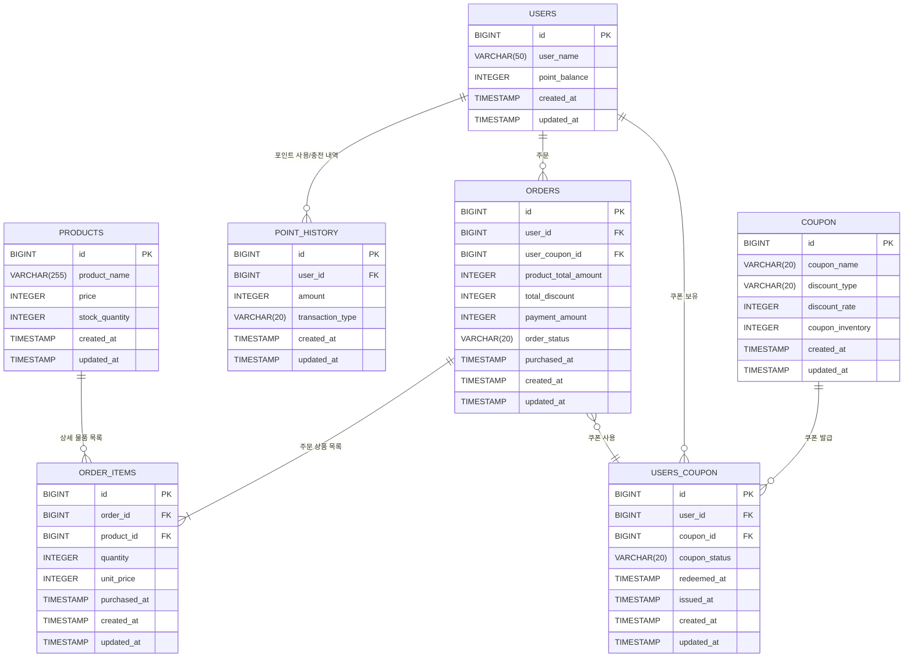

```mermaid
erDiagram
    USERS {
        BIGINT      id PK
        VARCHAR(50) user_name
        INTEGER     point_balance
        TIMESTAMP   created_at
        TIMESTAMP   updated_at
    }

    PRODUCTS {
        BIGINT          id PK
        VARCHAR(255)    product_name
        INTEGER         price
        INTEGER         stock_quantity
        TIMESTAMP       created_at
        TIMESTAMP       updated_at
    }

    POINT_HISTORY {
        BIGINT          id PK
        BIGINT          user_id FK
        INTEGER         amount
        VARCHAR(20)     transaction_type
        TIMESTAMP       created_at
        TIMESTAMP       updated_at
    }

    ORDERS {
        BIGINT      id PK
        BIGINT      user_id FK
        BIGINT      user_coupon_id FK
        INTEGER     product_total_amount
        INTEGER     total_discount
        INTEGER     payment_amount
        VARCHAR(20) order_status
        TIMESTAMP   purchased_at
        TIMESTAMP   created_at
        TIMESTAMP   updated_at
    }
    
    ORDER_ITEMS {
        BIGINT      id PK
        BIGINT      order_id FK
        BIGINT      product_id FK
        INTEGER     quantity
        INTEGER     unit_price
        TIMESTAMP   purchased_at
        TIMESTAMP   created_at
        TIMESTAMP   updated_at
    }
    
    COUPON {
        BIGINT          id PK
        VARCHAR(20)     coupon_name
        VARCHAR(20)     discount_type
        INTEGER         discount_rate
        INTEGER         coupon_inventory
        TIMESTAMP       created_at
        TIMESTAMP       updated_at
    }
    
    USERS_COUPON {
        BIGINT          id PK
        BIGINT          user_id FK
        BIGINT          coupon_id FK
        VARCHAR(20)     coupon_status
        TIMESTAMP       redeemed_at
        TIMESTAMP       issued_at
        TIMESTAMP       created_at
        TIMESTAMP       updated_at
    }

%% 관계 정의
    USERS    ||--o{ POINT_HISTORY   : "포인트 사용/충전 내역"
    USERS    ||--o{ ORDERS          : "주문"
    PRODUCTS ||--o{ ORDER_ITEMS     : "상세 물품 목록"
    ORDERS   ||--|{ ORDER_ITEMS     : "주문 상품 목록"
    ORDERS   }o--|| USERS_COUPON     : "쿠폰 사용"
    USERS    ||--o{ USERS_COUPON     : "쿠폰 보유"
    COUPON   ||--o{ USERS_COUPON     : "쿠폰 발급"
```