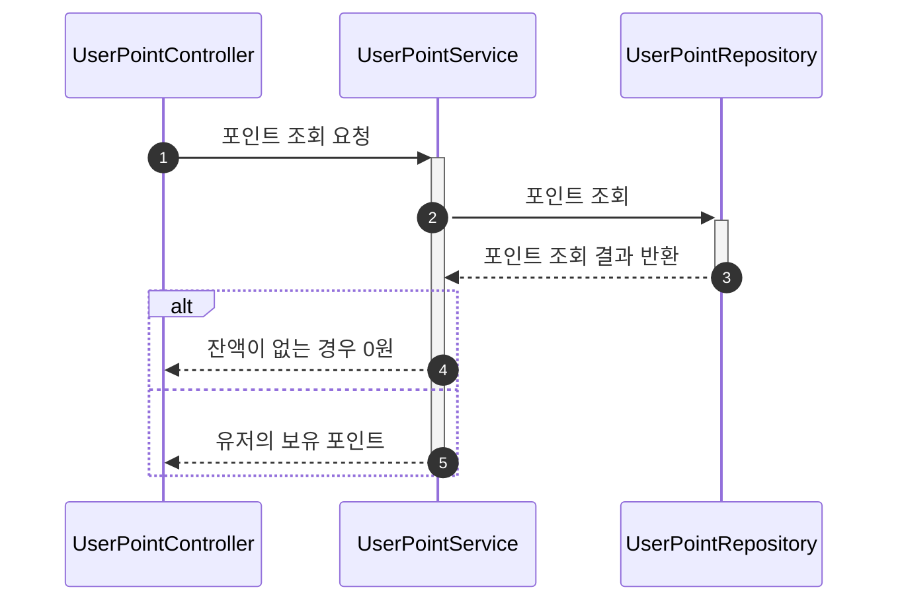
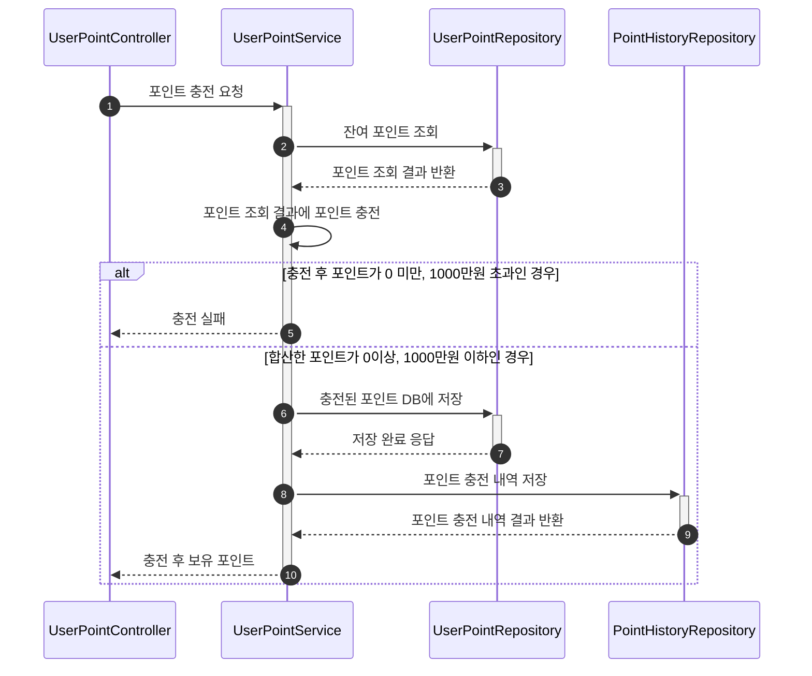
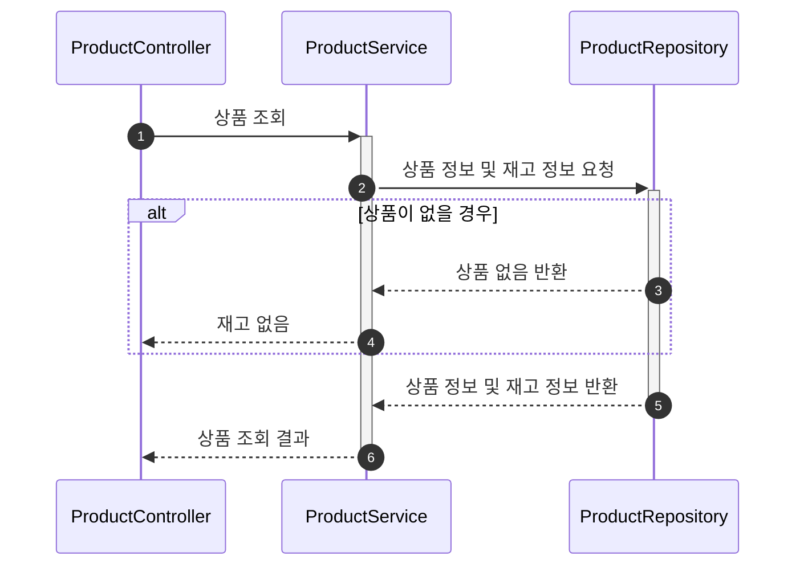
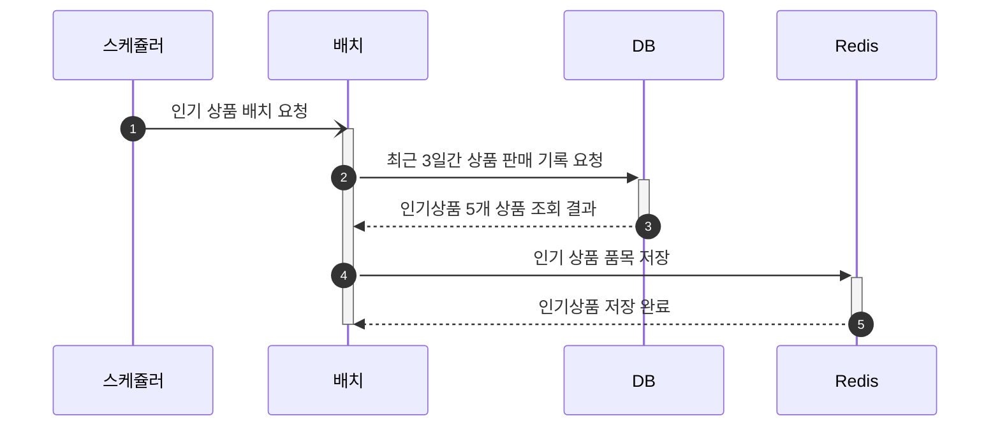
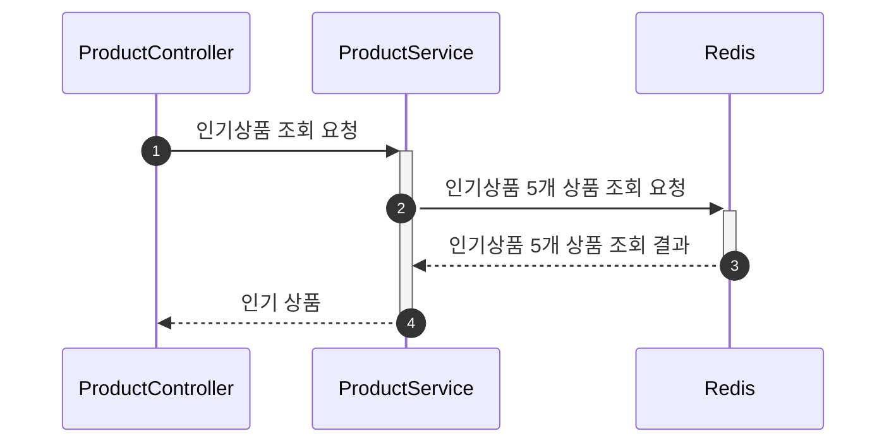
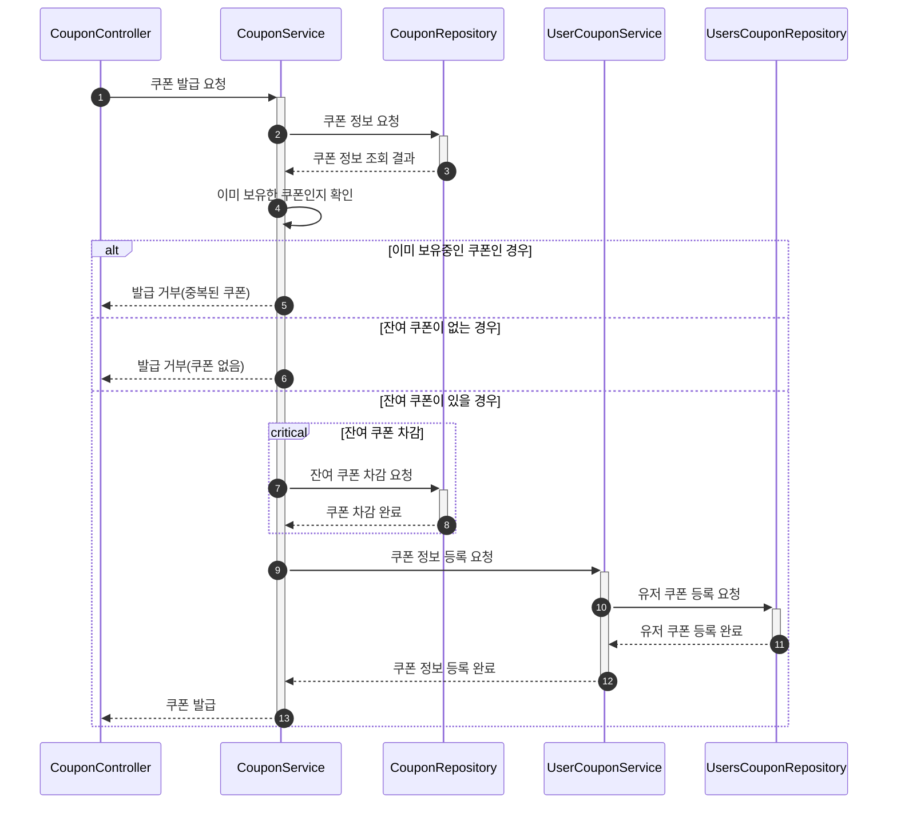
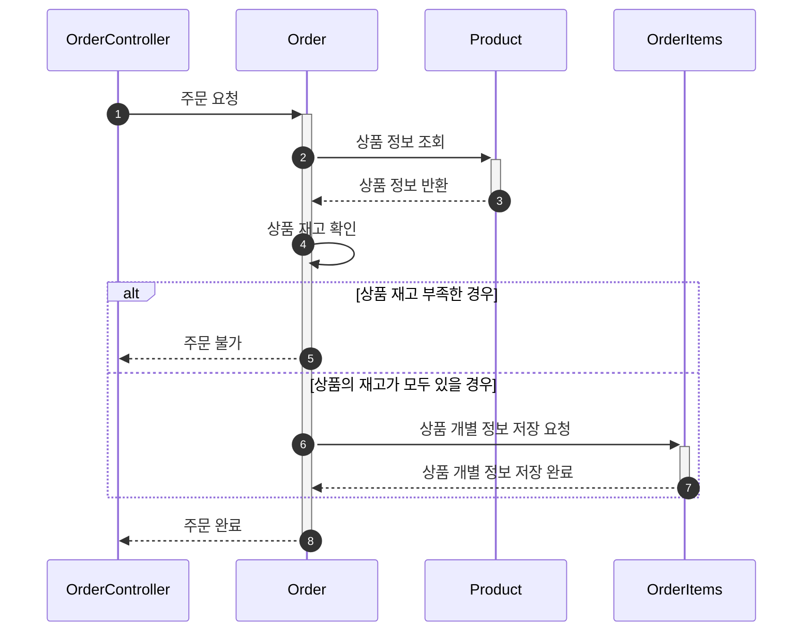
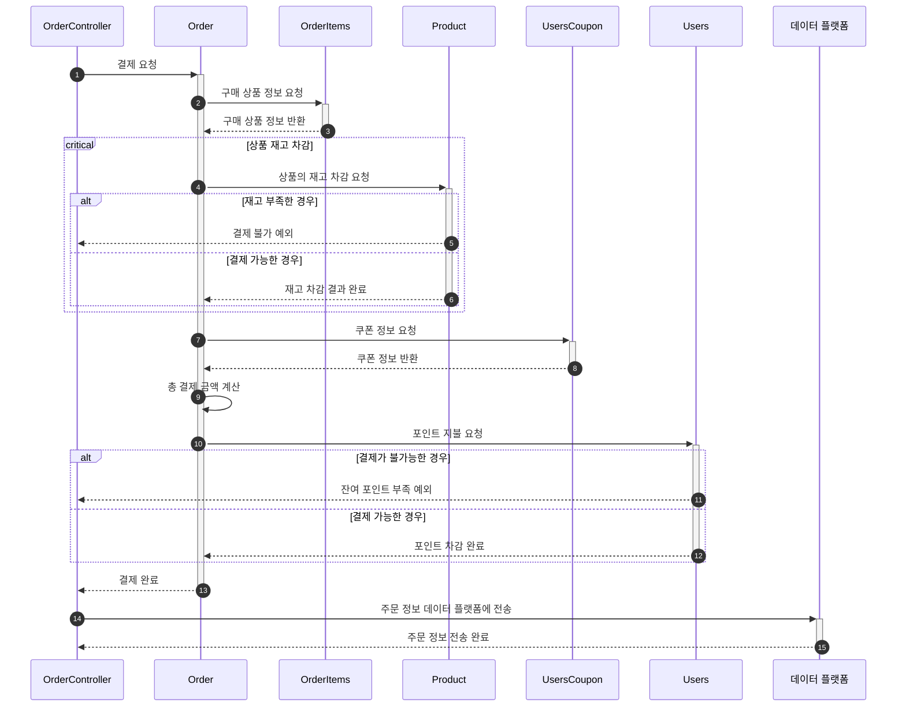

# 시퀀스 다이어그램 (Sequence Diagram)

각 기능별 시퀀스 다이어그램을 통해 해당 서비스의 이해를 돕고자 함.
--

## 설계 문서
- [1. 요구사항명세서](/docs/1.Requireements.md)
- [2. ERD](/docs/2.ERD.md)
- [2-1 DDL](/src/main/resources/schema.sql)
- [3. 시퀀스 다이어그램](/docs/3.SequenceDiagram.md)
- [4. API명세](/docs/4.APISpec.png)

##  📌 포인트
### 포인트 조회

#### 주요 내용 요약
- 4️⃣: 반환된 포인트가 없을 시 0을 반환

### 포인트 충전

#### 주요 내용 요약
- 1️⃣: 포인트 충전 요청 시 최대 충전 금액은 500만원까지 충전 가능
- 4️⃣: 포인트 조회 결과에 포인트 충전 요청시 보내준 포인트 합한다. (만일 포인트 조회 결과가 없을 경우 보유포인트를 0원으로 하고 포인트 충전한다.)
- 5️⃣: 총 포인트가 0미만, 1000만원 초과 일 경우 충전 실패 (InvalidAmountException)

## 🎁 상품
### 상품 조회

- 3️⃣ ~ 4️⃣ : Repository 에서 상품이 없을 경우 false 반환, 상품 조회 실패 (ProductNotFoundException)

### 인기상품 저장

- 1️⃣ : 매 12시간 마다 해당 배치 실행

### 인기상품 조회

## 🎟️ 쿠폰
### 쿠폰 선착순 발급

- 5️⃣: 동일한 쿠폰을 2개이상 보유 금지(DuplicateCouponException)
- 6️⃣: 잔여 쿠폰이 없는 경우(CouponOutOfInventoryException)
- 7️⃣~ 8️⃣: 동시성 제어를 통해 순번 보장

## 💳 결제
### 상품 주문

- 5️⃣: 주문 불가 예외 (InvalidOrderStateException), 재고 부족 제품명, 부족한 재고 반환

### 상품 결제

- 4️⃣~6️⃣: 동시성 제어를 통해 물품 재고 차감 시 순번 보장
- 9️⃣: 물품들의 총 금액애서 쿠폰의 할인 금액만큼 차감