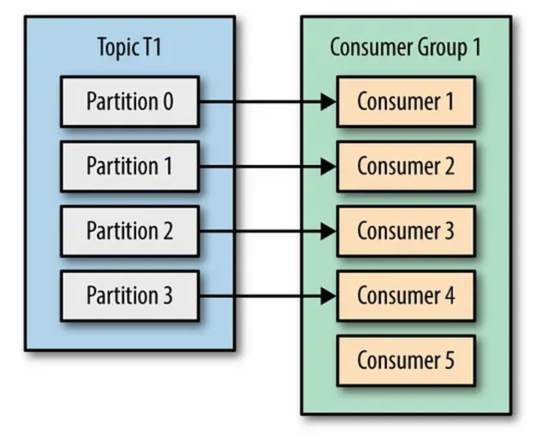

# Kafka

## 1.카프카란?
Kafka는 대규모 실시간 데이터 스트리밍과 이벤트 처리에 특화된 분산 메시징 플랫폼이다.
고성능 로그 저장소 기반의 아키텍처를 통해 초당 수십만 건 이상의 메시지를 안정적으로 처리할 수 있으며, 데이터의 순차적 기록과 파티션 단위 확장성을 제공한다.

## 2. 카프카를 사용하는 이유
전통적인 데이터 파이프라인은 각 시스템 간 직접적인 연계로 인해 의존성이 높아지고, 데이터 흐름이 파편화되는 문제가 발생한다. 이러한 구조는 변경과 확장이 어렵고, 장애가 한 시스템에서 다른 시스템으로 쉽게 전파되는 한계를 지닌다.
Kafka는 중앙 집중형 이벤트 스트리밍 플랫폼으로서 이러한 문제를 해결한다. 데이터의 흐름을 하나의 허브에서 관리함으로써 의존성을 줄이고 시스템 간 결합도를 낮추어, 보다 단순하면서도 유연한 아키텍처를 구축할 수 있다.
아래 내용을 통해 카프카의 이점들을 상세히 알아보고자 한다.

### 2.1 높은 처리량
디스크 기반의 순차적 I/O와 Zero-copy를 통해 초당 수십만 건 이상의 메시지를 안정적으로 처리할 수 있다.
이를 통해 대규모 트래픽 환경에서도 안정적인 성능을 보장한다.

### 2.2 확장성
파티션 단위로 데이터를 분산 처리할 수 있어, 브로커와 파티션 수를 늘리기만 하면 손쉽게 수평 확장이 가능하다. 
따라서, 데이터 증가와 트래픽 변화에 탄력적으로 대응할 수 있다.

### 2.3 영속성
메시지를 로그 형태로 영속적으로 저장하며, 컨슈머는 필요에 따라 특정 시점의 데이터를 다시 읽을 수 있다.
이는 데이터 손실을 최소화하고, 장애 복구나 재요청 시 유용하게 활용된다.

### 2.4 고가용성
클러스터 구조와 복제 매커니즘을 통해 특정 브로커에 장애가 발생하더라도 데이터의 가용성과 안정성을 보장한다. 
이를 통해 서비스 중단 위험을 크게 줄일 수 있다.

## 3. 카프카의 구성 요소
카프카의 구성요소는 다음과 같다.

각 상세한 설명은 아래와 같다.

### 3.1. 브로커 (Broker)
- 카프카 클러스터를 구성하는 각각의 서버를 의미한다. 메시지를 저장하고 클라이언트의 요청을 처리하는 핵심 서버의 역할을 수행한다.
- 특징
  - 메시지 저장소: 프로듀서로부터 받은 메시지를 디스크에 저장하고 컨슈머에게 전달
  - 클러스터 구성: 여러 브로커가 모여 하나의 카프카 클러스터를 형성
  - 고가용성: 브로커 간 데이터 복제를 통해 장애 시에도 서비스 지속 가능
  - 리더/팔로워 구조: 각 파티션마다 하나의 리더 브로커와 여러 팔로워 브로커가 존재

### 3.2. 토픽 (Topic)
- 토픽은 메시지를 논리적으로 분류하는 단위로, 관련된 메시지들이 저장되는 카테고리이다.
- 특징
  - 논리적 분류: 비즈니스 목적에 따라 메시지를 구분하는 단위 (예: user-events, order-logs)
  - 다중 파티션 구성: 하나의 토픽은 여러 파티션으로 나뉘어 병렬 처리 지원
  - 메시지 순서: 토픽 전체에서는 순서가 보장되지 않지만, 같은 파티션 내에서는 순서 보장
  - retention 정책: 메시지 보관 기간과 크기를 설정하여 자동 삭제 관리

### 3.3. 파티션 (Partition)
- 토픽을 물리적으로 분할할 단위로, 실제 메시지가 저장되는 최소 단위이다.
- 특징
  - 병렬 처리: 여러 파티션으로 분산하여 처리량(throughput) 향상
  - 순서 보장: 같은 파티션 내 메시지는 들어온 순서대로 저장 및 소비
  - 분산 저장: 각 파티션은 서로 다른 브로커에 분산 저장 가능
  - 오프셋(Offset): 각 메시지는 파티션 내에서 고유한 오프셋 번호를 가짐
  - 복제(Replication): 데이터 안정성을 위해 여러 브로커에 복사본 저장

### 3.4. 프로듀서 (Producer)
- 카프카 토픽에 메시지를 발행(publish)하는 클라이언트 애플리케이션이다.
- 특징
  - 메시지 발송 : 비즈니스 로직에서 생성된 데이터를 카프카로 전송
  - 파티션 라우팅 : 메시지 키를 기반으로 특정 파티션으로 라우팅
  - 배치처리 : 성능 향상을 위해 여러 메시지를 모아서 한번에 전송
  - 확인(Acknowledgment) : 메시지 전송 성공여부를 확인하는 다양한 보장 수준 제공
  - 압축 및 직렬화 : 메시지 크기 최적화와 데이터 형식 변환

### 3.5. 컨슈머 (Consumer)
- 카프카 토픽에서 메시지를 구독(subscribe)하고 소비하는 클라이언트 애플리케이션이다.
- 특징 : 
  - 메시지 소비 : 토픽의 파티션에서 메시지를 읽어와 처리
  - 오프셋 관리 : 어디까지 메시질ㄹ 읽었는지 위치 정보를 관리
  - 풀(Pull)모델 : 컨슈머가 능동적으로 메시지를 가져오는 방식
  - 배치 처리 : 여러 메시지를 한번에 가져와서 효율성 증대
  - 자동/수동 커밋 : 오프셋 커밋 방식을 선택하여 중복처리 방지

### 3.6. 컨슈머 그룹 (Consumer Group)
- 하나의 토픽을 함께 소비하는 컨슈머들의 논리적 그룹이다.
- 특징 : 
  - 부하 분산 : 그룹 내 여러 컨슈머가 파티션을 나누어 처리하여 병렬 소비
  - 파티션 할당 : 각 파티션은 그룹 내 하나의 컨슈머에게만 할당
  - 자동 리밸런싱 : 컨슈머 추가/제거 시 파티션 재분배 자동 수행
  - 고가용성 : 한 컨슈머가 실패해도 다른 컨슈머가 해당 파티션을 이어 받음
  - 독립적 소비 : 서로 다른 컨슈머 그룹은 같은 메시지를 독립적으로 소비가 가능

### 3.7. 리밸런싱 (Rebalancing)
- 컨슈머 그룹 내에서 컨슈머의 추가·제거·장애 발생 시 파티션 할당을 재조정하는 과정이다.
- 특징 : 
  - 자동 재분배 : 컨슈머 변경 시 파티션을 자동으로 재할당하여 균등한 부하 분산
  - 그룹 코디네이터 : 특정 브로커가 컨슈머 그룹의 리밸런싱을 관리
  - 일시적 중단 : 리밸런싱 중에는 해당 그룹의 모든 컨슈머가 일시적으로 메시지 소비 중단
  - 트리거 조건 : 새로운 컨슈머 합류, 기존 컨슈머 이탈, 파티션 수 변경, 컨슈머 장애 등
  - 파티션 할당 전략 : Range, RoundRobin, Sticky 등 다양한 할당 전략 지원

### 3.8. 클러스터 (Cluster)
- 여러 대의 브로커 서버가 하나의 논리적 단위로 구성된 카프카 시스템이다.
- 특징 : 
  - 분산 시스템 : 여러 브로커가 협력하여 하나의 큰 시스템으로 동작
  - KRaft 모드 : 카프카 자체적으로 메타데이터를 관리하는 새로운 방식 (기존 Zookeeper 의존성 제거)
  - 브로커 ID : 각 브로커는 고유한 ID를 가지며 클러스터 내에서 식별
  - 수평 확장 : 브로커를 추가하여 저장 용량과 처리 성능 확장 가능
  - 로드 밸런싱 : 파티션과 리더십이 브로커들에게 고르게 분산
  - 단일 진입점 : 클라이언트는 클러스터를 하나의 시스템으로 인식하고 접근

### 3.9. 레플리케이션 (Replication)
- 데이터의 안정성과 가용성을 보장하기 위해 파티션의 복사본을 여러 브로커에 저장하는 메커니즘이다. 
- 특징 : 
  - 리더-팔로워 구조 : 각 파티션마다 하나의 리더와 여러 팔로워 레플리카 존재
  - 복제 팩터 (Replication Factor) : 각 파티션의 총 복사본 개수 설정 (일반적으로 3개)
  - ISR(In-Sync Replicas) : 리더와 동기화 상태를 유지하는 레플리카 목록
  - 자동 장애복구 : 리더 브로커 장애 시 ISR 중 하나가 새로운 리더로 선출
  - 데이터 일관성 : 리더만 읽기/쓰기를 처리하여 데이터 일관성 보장
  - 내결함성 : 복제 팩터 -1 만큼 브로커 장애를 견딜 수 있음

## 4. 카프카 구성 요소의 흐름
카프카는 메시지 발행 -> 로그 저장 -> 소비 순으로 흐른다.
1. 프로듀서는 메시지를 특정 토픽에 발행한다.
2. 브로커는 수신한 메시지를 지정된 파티션에 저장한다.
3. 컨슈머는 토픽을 구독하고, 할당된 파티션으로부터 메시지를 소비한다.

### 4.1. 파티션과 컨슈머 간의 관계

#### 4.1.1. 파티션 수 > 컨슈머 수

이 경우, 한 컨슈머가 여러 파티션을 동시에 담당한다.
  - 장점 : 컨슈머 수를 최소화 하면서도 여러 파티션을 처리할 수 있음
  - 단점 : 하나의 컨슈머에 부하가 집중될 수 있어, 처리 속도가 상대적으로 떨어질 수 있음
  - 활용 : 처리량보다 안정성이나 리소스 절약이 더 중요한 상황에서 적합

#### 4.1.2. 파티션 수 = 컨슈머 수

이 경우, 가장 균형 잡힌 상태이다.
  - 장점 : 각 파티션이 전담 컨슈머에게 배정되어, 모든 파티션을 병렬로 처리
  - 단점 : 컨슈머가 하나라도 장애 나면 해당 파티션은 리밸런싱이 필요
  - 활용 : 최대 처리량과 균등 부하 분산이 필요한 경우 이상적

#### 4.1.3. 파티션 수 < 컨슈머 수

이 경우, 여분의 컨슈머가 대기상태가 된다.
  - 장점 : 일부 컨슈머가 대기상태라, 장애 발생 시 빠른 리밸런싱 가능
  - 단점 : 파티션보다 컨슈머 수가 많아도, 초과된 컨슈머는 할당받을 파티션이 없어 유휴 상태가 됨 -> 리소스 낭비
  - 활용 : 대기 컨슈머를 확보해 빠른 장애 대응 가능

## 5. 팁
### 5.1. 파티션 증설은 신중
- 파티션을 합칠 때, 각 파티션간의 메시지 순서를 보장의 어려움 
- 컨슈머 그룹은 파티션별로 오프셋을 관리하여, 파티션을 줄일 경우 오프셋 정보가 꼬일 수 있음
- 파티션을 줄일 떄, 저장된 메시지를 재분배·재배치해야하는데, 이는 토픽 전체 재생성 & 리프로세싱과 동일한 비용

성능상의 문제는 거의 대부분 컨슈머의 로직 문제일 경우가 많으므로, 컨슈머를 개선하는 방향으로 하는 등 파티션 증설은 최대한 신중하게 적용할 것

### 5.2. auto.offset.reset 옵션을 earlist 로 설정해야 하는 이유
- 파티션을 증설하면 새 파티션에 데이터가 쌓일 수 있는데, 컨슈머가 이를 인식하기 전까지 누락 위험이 존재한다.
- latest로 설정 시 기존에 쌓인 메시지를 건너뛰고 최신 데이터부터 읽게 된다.
따라서, 증설 시 안전하게 모든 메시지를 보장하려면 earliest로 설정하는 것이 권장된다.

## 6. Kafka CLI 명령어들
### 6.1. 토픽 관련
- 토픽 목록 조회
```shell
kafka-topics.sh --list                # 토픽 조회
  --bootstrap-server localhost:9092   # 연결할 브로커
```

- 토픽 생성
```shell
kafka-topics.sh --create \            # 새로운 토픽 생성
  --topic my-topic \                  # 토픽 명 
  --partitions 3  \                   # 파티션 개수
  --replication-factor 2 \            # 복제본 개수
  --bootstrap-server localhost:9092   # 연결할 브로커
```

- 토픽 상세 조회
```shell
kafka-topics.sh --describe \          # 토픽의 상세 메타데이터 출력 (리더 브로커, ISR< 파티션 정보 등)
  --topic my-topic \                  # 특정 토픽만 조회 (옵션 생략 시 전체 출력)
  --bootstrap-server localhost:9092
```

- 토픽 삭제 방법
```shell
kafka-topics.sh \
--bootstrap-server localhost:9092 \
--delete \                            # 지정한 토픽 삭제
--topic my-topic
```
단, 브로커에서 delete.topic.enable=true 설정이 필요

- 파티션 수 확장
```shell
kafka-topics.sh --alter \             # 기존 토픽 수정
  --topic my-topic \
  --partitions 6 \                    # 파티션 개수를 늘릴 때 사용 (줄이는 건 불가)
  --bootstrap-server localhost:9092
```

### 6.2. 프로듀서 관련
- 메시지 생성
```shell
kafka-console-producer.sh \
  --broker-list localhost:9092 \       # 메시지를 보낼 브로커 목록 (--bootstrap-server 로 대체 가능)
  --topic my-topic                     # 메시지를 발행할 토픽
```
-> 실행 후 터미널에 입력한 문자열이 메시지로 전송

### 6.3. 컨슈머 관련
- 메시지 소비
```shell
kafka-console-consumer.sh \
  --bootstrap-server localhost:9092 \   # 메시지를 받을 브로커
  --topic my-topic \                    # 구독할 토픽 명
  --from-beginning \                    # 현재 오프셋이 아닌 "가장 처음" 부터 메시지 소비 (핊수 아님)
  --group test-group                    # 컨슈머 그룸 이름 지정 (없으면 임시 그룹 생성)
```

### 6.4 오프셋 관리
- 컨슈머 그룹 목록 조회
```shell
kafka-consumer-groups.sh \
  --bootstrap-server localhost:9092 \ 
  --list                                # 존재하는 컨슈머 그룹 전부 출력
```

- 컨슈머 그룹 삭제
```shell
kafka-consumer-groups.sh \ 
  --bootstrap-server localhost:9092 \ 
  --delete \                            # 컨슈머 그룹 삭제
  --group test-group
```

- 그룹 상세 조회
```shell
kafka-consumer-groups.sh \           
  --bootstrap-server localhost:9092 \
  --describe \                          # 그룹 상태, 파티션 할당, 오프셋, lag 확인 
  --group my-group                      # 특정 그룹 지정
```

- 오프셋 초기화
```shell
kafka-consumer-groups.sh \
  --bootstrap-server localhost:9092 \
  --group my-group \
  --topic my-topic \
  --reset-offsets \                     # 오프셋을 재설정 모드로 실행
  --to-earliest \                       # 파티션의 가장 처음으로 이동 (--to-latest, --to-offset <n>, --shift-by <n> 옵션도 있음)
  --execute                             # 실제 실행 (없으면 dry-run) 
```

### 6.5 브로커/클러스터 상태
- API 버전 확인 (브로커가 지원하는 API 버전을 출력 -> 클라이언트 호환성 점검)
```shell
kafka-broker-api-versions.sh --bootstrap-server localhost:9092
```

- Under-replicated 파티션 확인
```shell
kafka-topics.sh \
  --describe \
  --under-replicated-partitions \          # 정상 복제되지 않은 파티션만 출력
  --bootstrap-server localhost:9092
```