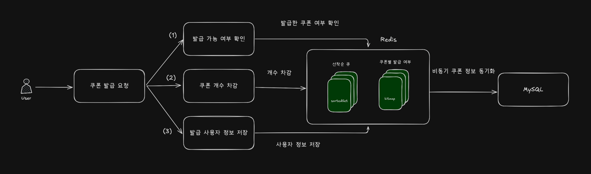
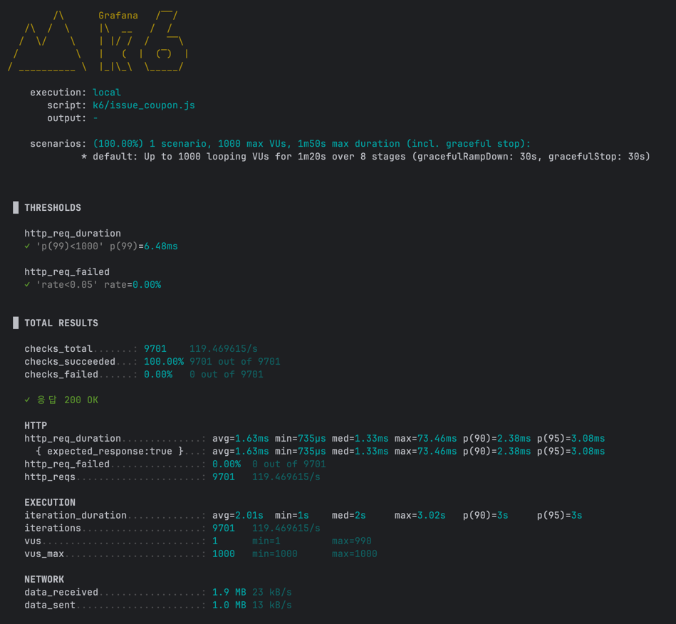

# 선착순 쿠폰 발급 설계/개발 문서
> 쿠폰 발급 요청을 선착순으로 등록하고, 비동기로 처리하도록 설계한다. 해당 설계를 바탕으로 구현하고자 한다.

## Redis 기반 선착순 쿠폰 발급 기능 설계
### 목표
- 많은 트래픽에도 정해진 수량만큼 발급되도록 제어
- 쿠폰 신청 및 중복 검증을 Redis 에서 처리하여 DB의 부하를 최소화
- 요청 순서 보장, 중복 발급 차단을 통해 신뢰성 시스템을 설계
- 신청은 큐를 통해 빠르게 응답하고, 실제 발급은 배치를 통해 비동기로 수행

### Key & 자료구조
- Key : 중복 발급 차단 (DB:COUPON:ISSUED:{couponId}), 쿠폰 발급 대기열 (DB:COUPON:QUEUE:{couponId})
- 발급 발급 차단 : 자료구조 bitmap을 사용하여 userId에 해당하는 bit를 발급 시 1(true)로 설정하여 중복 발급 방지
- 쿠폰 발급 대기열 : 자료구조 SortedSet 사용하여 value에 userId, score에 currentTimeMillis을 저장하여 서버에 요청이 도달한 기준으로 우선순위 정렬

### 구상도

1. 쿠폰 발급 여부 확인 후, 발급 가능할 경우 쿠폰 발급 대기열에 등록(발급 대기열에 있을 땐, 여러번 요청을 보내도 남은 대기순번 반환)
2. 스케줄을 통해 현재 Redis에 있는 쿠폰 대기열을 scan 하여 4초마다 10개의 대기유저들의 수만큼 쿠폰 차감
3. 위 스케줄에서 쿠폰 차감 후, MySQL에 쿠폰 정보 적재

### 기능 구현
- 쿠폰 발급 대기열 등록
```java
    public Integer enterCouponQueue(Long userId, Long couponId) {
        String issuedKey = baseIssuedKey + ":" + couponId;
        String couponQueueKey = baseQueueKey + ":" + couponId;
        if (couponIssuedRepository.hasCouponIssued(issuedKey, userId)) {
            throw new RestApiException(CouponErrorCode.ALREADY_ISSUED);
        }
        return couponIssuedRepository.enrollAndGetRank(couponQueueKey, userId);
    }
```
1. 이미 발급 받은 유저인지 확인 후, 발급 받은 유저일 경우 예외처리
2. NX 옵션을 통해 재요청 시 선착순을 덮어쓰는 것이 아닌, 변경사항이 없고, 잔여 대기자 수 반환

- 스케줄을 통해 쿠폰 발급
```java
@Scheduled(cron = "0/4 * * * * *", zone = "Asia/Seoul")
@SchedulerLock(
        name = "LOCK:COUPON:ISSUED",
        lockAtLeastFor = "PT2S",
        lockAtMostFor = "PT10S"
)
public void aggregateIssueCoupon() {
    List<String> couponKeys = couponIssuedRepository.scanKeys(queueKey+ ":*");
    couponKeys.forEach(couponFacade::processCouponIssueQueue);
}
```
1. SchedulerLock 을 적용하여 어플리케이션이 Scale Out 될 때, 스케줄러가 여러번 동작하는 것을 방지
2. 4초마다 배치를 통해 쿠폰 발급 (쿠폰 발급 후 바로 사용하는 유저가 있을 수 있으므로, 최대한 짧은 시간에서 쿠폰 발급)
3. redis에 scan을 통해 쿠폰 대기열을 모두 조회 후, 쿠폰 대기열에 유저가 있을 경우, 쿠폰 발급

### 성능 테스트

대부분의 요청이 1~3ms 수준으로 빠르게 응답하였으며, 최대의 경우 73ms 에 불과하다.
다만, 이 API는 Queue 등록만 처리하므로, 실제 발급 확정 성능은 별도 측정이 필요하다. 
추후, Prometheus 등으로 DB insert 완료 확인을 측정해야 할 것으로 보인다.

### 결론
설계를 통해 쿠폰 발급 요청을 큐잉 방식으로 처리하고, 고트래픽 상황에서도 빠르고 안정적인 시스템 동작을 확보
- 응답 시간 : 큐잉을 통해 대체로 우수한 응답 속도를 달성
- 편의성 : 유저는 반복적인 요청을 통해, 현재 나의 대기열이 몇번째인지 확인 가능
- DB 부하 절감 : 쿠폰의 중복 검증, 동기화를 배치를 통해서 하므로 DB의 Write 경쟁을 최소화

다만, 실제 발급 확정 처리 성능은 별도의 측정이 필요하다.


