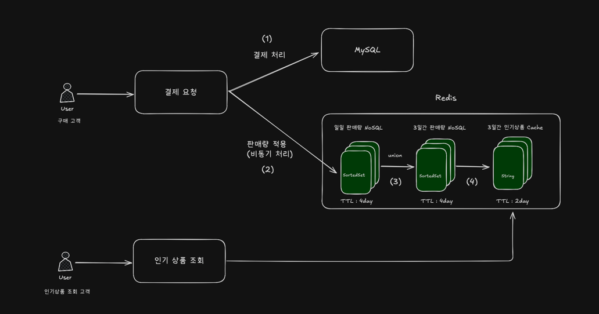
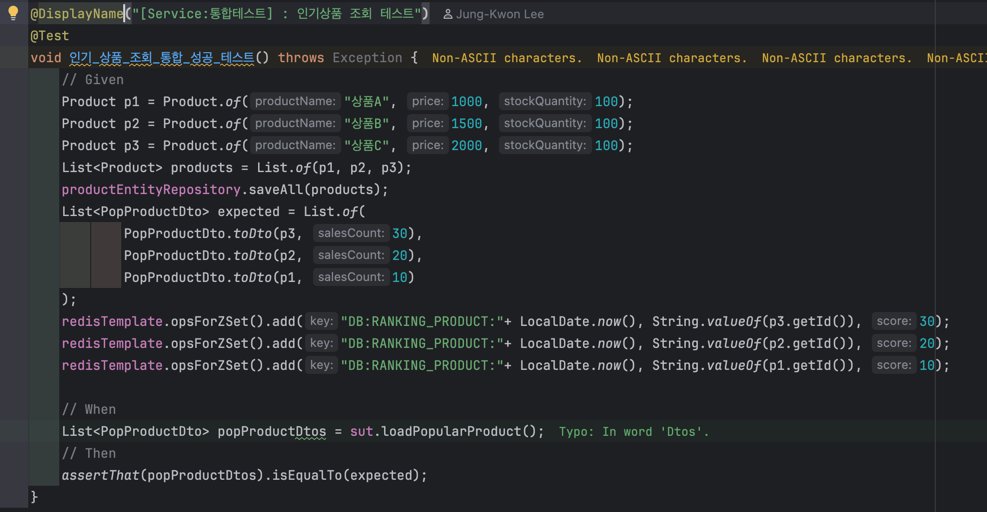
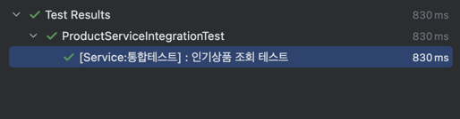

# 인기상품 설계/개발 문서
> 3일간 가장 많이 주문한 상품의 랭킹을 설계한다. 해당 설계를 기반으로 구현하고자 한다.

## Redis 기반 인기상품 조회 기능 설계
### 목표
- DB는 상품의 정보 적재 + Redis를 통한 인기상품 집계 + 캐싱을 통해 인기상품 조회 성능 개선  -> Redis에 인기상품 관리 및 집계를 위임하여 DB의 부하를 감소
- 금일을 제외한 3일의 데이터를 통해 3일간의 상품의 판매량을 통해 순위 조회
- 캐시를 통해 빠른 랭킹 조회

### Key & 자료구조
- Key : 일일 상품 판매량 (DB:POP_PRODUCT:2025-08-21), 3일간 인기 상품 (DB:RANKING_PRODUCT:2025-08-21), 인기 상품 캐시 (PRODUCT::PP::POP_PRODUCT_LIST:2025-08-22)
- SortedSet : 상품의 판매량을 score로 관리하여 인기상품 정렬을 용이하도록 함

### 구상도

1. 결제 내역을 DB에 바로 적재
2. EventListener를 통해 비동기로 NoSQL에 SortedSet 자료구조로 저장 (score : 상품 판매량)
3. 스케쥴을 통해 당일을 제외한 일일 판매량 데이터를 통해 ZUNIONSTORE를 통해 3일간의 판매량 데이터를 생성
4. 해당 데이터를 Cache로 저장하여 조회 성능 향상

### 기능 구현
- 결제 로직
```java
    @DistributedLock(keyGenerator = OrderItemLockKeyGenerator.class)
    public void payProcess(PayCommand payCommand) {
        // ... 결제 차감 로직
        
        // Redis에 판매 내역 적재 시 
        eventPublisher.publishEvent(new PaymentCompletedEvent(order.getId(), orderItems.stream()
                .map(OrderItemEventDto::from)
                .toList()));
    }
```
- 이벤트 리스너
```java
    @Async
    @TransactionalEventListener(phase = TransactionPhase.AFTER_COMMIT)
    public void handlePaymentCompleted(PaymentCompletedEvent event) {
        Map<String, Long> salesData = event.orderItems().stream().collect(Collectors.groupingBy(
                orderItem -> String.valueOf(orderItem.productId()),
                Collectors.summingLong(OrderItemEventDto::quantity)
        ));
        salesProductRepository.addSalesQuantity(salesData);
    }
```
트랜잭션과 분산락의 점유시간을 조금이라도 줄이고자 비동기로 Redis에 판매량을 적재하도록 하였습니다.

- 스케줄을 통해 인기상품 집계 및 캐시 적용
```java
    @Scheduled(cron = "5 0 0 * * *", zone = "Asia/Seoul")
    @SchedulerLock(
            name = "LOCK:DAILY_POP_PRODUCT",
            lockAtLeastFor = "PT1M",
            lockAtMostFor = "PT10M"
    )
    public void aggregateDailyPopularProducts() {
        productService.refreshPopularProduct();
    }
```
1. SchedulerLock 을 적용하여 어플리케이션이 Scale Out 될 때, 스케줄러가 여러번 동작하는 것을 방지
2. 매 00시00분05초에 인기상품 집계 및 캐시 적용

- 인기상품 조회 통합 테스트



- 테스트 성공 결과

### 성능 테스트

| 항목              | DB 조회 (Before)                           | 캐시 조회 (After)    | 향상률(%)         |
| --------------- | ---------------------------------------- | ---------------- | -------------- |
| 테스트 시나리오        | 1000명 가상 사용자, 최대 1,000 VUs, 약 2분간 부하 테스트 | 동일 시나리오          | -              |
| 성공률             | 100% (9740/9740)                         | 100% (9653/9653) | -              |
| 실패율             | 0%                                       | 0%               | -              |
| 평균 응답 시간        | 3.61ms                                   | 1.38ms           | 약 **61.8% 향상** |
| 최소 응답 시간        | 1.29ms                                   | 0.402ms          | 약 **68.8% 향상** |
| 최대 응답 시간        | 148.71ms                                 | 46.78ms          | 약 **68.6% 향상** |
| 90% 응답 시간 (p90) | 5.38ms                                   | 2.27ms           | 약 **57.8% 향상** |
| 95% 응답 시간 (p95) | 6.95ms                                   | 2.81ms           | 약 **59.6% 향상** |
| 처리량 (req/s)     | 약 121.05 요청/초                            | 약 117.53 요청/초    | 거의 동일 (-2.9%)  |

### 결론
DB의 조회 및 집계를 Redis에 위임을 통해 성능 부하를 줄이고, DB 조회보다 우수한 성능을 얻을 수 있음을 확인하였다.
- 응답 시간 : 모든 구간에서 60~70% 이상 성능 개선을 달성 하였다. 특히 최대 응답시간을 148ms -> 48ms 로 줄어들어 안정적인 응답을 보장헀다.
- 안정성 : 모두 실패율을 0%로 안정적이었으나, 캐시는 tail latency까지 줄여 고트래픽 상황에서도 일관된 성능을 제공하였다.
- 처리량 : 초당 처리 요청수는 유사한 수준을 유지하면서, 흴씬 낮은 리소스로 더 빠른 응답을 제공하였다.