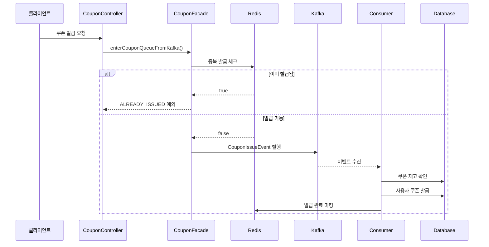

# 쿠폰 발급 카프카 개선 설계

## 🎯 배경
기존 쿠폰 발급 시스템은 **Redis 기반으로 구현**되어 있었으나, **Redis의 한계로 인해 다수의 쿠폰을 효율적으로 발급하기 어려운 문제**가 발생했다.

### 기존 Redis 기반 시스템의 한계
1. **처리량 제약**: Redis의 단일 스레드 특성으로 인한 대량 쿠폰 발급 시 병목 발생
2. **확장성 한계**: 다수의 쿠폰을 동시에 발급할 때 Redis 큐 관리의 복잡성 증가
3. **순서 보장 어려움**: 여러 쿠폰에 대한 발급 요청의 순서 처리가 복잡함
4. **메모리 제약**: 대량의 쿠폰 대기열을 Redis 메모리에 유지하는 것의 한계

### 추가적인 아키텍처 문제점  
1. **코드 중복**: 향후 도메인별 모듈 분리 시 Kafka 코드가 중복 구현될 우려
2. **단일 모듈 구조**: 모든 기능이 하나의 모듈에 집중되어 관리 복잡도 증가
3. **테스트 격리 문제**: Kafka TestContainer에서 offset 공유로 인한 테스트 간섭

이러한 문제를 해결하기 위해 **Kafka 기반 쿠폰 발급 시스템으로 개선**하고, 향후 도메인별 모듈 분리를 대비하여 **Kafka 인프라 모듈을 선제적으로 분리**하였다.

## 🛠️ 멀티모듈 아키텍처 전략

### 선택된 전략: 관심사 분리 기반 모듈화
코드 중복을 해결하고 확장성을 확보하기 위해 **도메인별 모듈 분리 대신 관심사별 모듈 분리** 전략을 채택하였다.

```
hhplus-server-java/
├── server/                          # 🎯 메인 애플리케이션
│   ├── src/main/java/kr/hhplus/be/server/
│   │   ├── coupon/                 # 쿠폰 도메인
│   │   ├── order/                  # 주문 도메인  
│   │   └── user/                   # 사용자 도메인
│   └── src/test/java/              # 통합 테스트
├── infrastructure-kafka/           # ⚡ Kafka 인프라 모듈
│   ├── config/KafkaConfig.java    # Kafka 설정
│   ├── repository/KafkaRepository.java  # 메시지 발행
│   ├── common/Topics.java         # 토픽 정의
│   └── resources/application-kafka.yml
└── common/                         # 🔧 공통 의존성
    └── Spring Boot 기본 설정
```

### 모듈화 전략 선택 이유

**1) 도메인별 분리 vs 관심사별 분리**
- **도메인별 분리**: `coupon-module`, `order-module` 형태
- **관심사별 분리**: `infrastructure-kafka`, `server` 형태 ✅ **채택**

**선택 근거:**
- Kafka는 여러 도메인에서 공통으로 사용되는 인프라 컴포넌트
- 도메인별 분리 시 Kafka 설정이 각 모듈에 중복 구현될 우려 (추후 도메인별 분리 계획이 있으므로)
- 현재 단계에서는 관심사 분리를 통한 코드 중복 해결이 우선

## 🚀 Kafka 기반 설계 전략

### 토픽 및 파티션 전략 검토
Kafka를 활용한 쿠폰 발급 시스템 개선을 위해 두 가지 전략을 검토하였다.

**1) 파티션 키를 쿠폰 ID로 설정** ✅ **채택**
```yaml
Topic: coupon_issue
Key: 쿠폰 ID (String.valueOf(couponId))
Partition 수: 3개 (확장 가능)
```

**장점:**
- 동일 쿠폰에 대한 요청 순서 보장
- 구현이 간단하고 토픽 관리 용이
- 파티션 키 기반 라우팅으로 데이터 일관성 확보

**단점:**
- 쿠폰별 트래픽 불균형 시 Hot Partition 발생 가능
- 처리량 확장에 일정 한계 존재

**2) 토픽을 쿠폰 ID별로 분리**
```yaml
Topic: coupon_issue_{couponId}
Key: 없음 또는 userId
Partition 수: 쿠폰별 독립 설정
```

**장점:**
- 쿠폰별 독립적인 처리량 확장 가능
- 파티션을 자유롭게 구성 가능

**단점:**
- 매 쿠폰마다 토픽 생성 필요 (운영 복잡도 증가)
- Kafka 클러스터에 과도한 Topic 증가 우려
- 동적 토픽 생성에 따른 권한 및 설정 관리 복잡

### 선택된 전략: 파티션 키 방식
**운영 단순성과 개발 복잡도를 고려하여 "파티션 키를 쿠폰 ID로 설정"하는 방식을 채택**하였다.

### 메시지 구조
```java
@Getter
@NoArgsConstructor
@AllArgsConstructor
public class CouponIssueEvent {
    private Long couponId;
    private Long userId;
    private LocalDateTime requestedAt;
    
    public static CouponIssueEvent of(Long couponId, Long userId) {
        return new CouponIssueEvent(couponId, userId, LocalDateTime.now());
    }
}
```

## 🏗️ Kafka 기반 구현

### Spring Boot Auto-Configuration 전략
infrastructure-kafka 모듈을 라이브러리처럼 사용하기 위해 **Spring Boot Auto-Configuration**을 적용하였다.

```java
// KafkaAutoConfiguration.java
@AutoConfiguration
@Import({
    KafkaConfig.class,
    KafkaRepository.class
})
public class KafkaAutoConfiguration {
}

// META-INF/spring/org.springframework.boot.autoconfigure.AutoConfiguration.imports
kr.hhplus.be.infrastructure.kafka.KafkaAutoConfiguration
```

이를 통해 server 모듈에서 별도 설정 없이 Kafka 기능을 자동으로 사용할 수 있다.

### Kafka 기반 쿠폰 발급 시스템의 장점

**Redis 단독 시스템**에서 **Redis + Kafka 하이브리드 시스템**으로 개선하여 다음과 같은 장점을 확보:

- **높은 처리량**: Kafka의 파티션 기반 병렬 처리로 대량 쿠폰 발급 처리 가능
- **확장성**: 파티션 수 증가를 통한 수평적 확장 지원
- **내구성**: Kafka의 영속성으로 메시지 손실 방지
- **순서 보장**: 쿠폰 ID를 파티션 키로 사용하여 동일 쿠폰의 발급 순서 보장
- **Redis 역할 최적화**: 중복 발급 체크와 발급 완료 상태 관리로 역할 특화
- **DB 최종 저장**: 최종 쿠폰 발급 정보의 영속적 저장

### 쿠폰 발급 플로우

#### 3.1 요청 처리 플로우


## 📊 성능 테스트 결과 분석

### K6 부하 테스트를 통한 Redis vs Kafka 성능 비교

동일한 조건에서 **Redis 기반 쿠폰 발급**과 **Kafka 기반 쿠폰 발급** 시스템의 성능을 측정하였습니다.

#### 테스트 환경
- **테스트 도구**: K6
- **부하 패턴**: 1000 VUs, 1m50s 동안 8단계 부하 증가
- **측정 대상**: 동일한 쿠폰 발급 API 엔드포인트

#### 🔍 성능 측정 결과

| **측정 항목** | **Redis 기반** | **Kafka 기반** | **개선 효과** |
|-------------|---------------|---------------|-------------|
| **총 요청 수** | 9,701건 | 9,670건 | 거의 동일 |
| **성공률** | 100.00% | 100.00% | 안정성 동일 |
| **실패율** | 0.00% | 0.00% | 무실패 달성 |
| **평균 응답시간** | 1.63ms | 1.64ms | 거의 동일 |
| **P95 응답시간** | 3.08ms | 3.77ms | 0.69ms 차이 |
| **P99 응답시간** | 6.48ms | 9.25ms | 2.77ms 차이 |
| **처리량** | 119.46 req/s | 120.19 req/s | **0.6% 향상** |

#### 📈 성능 분석 결과

**✅ 주요 개선 사항**
- **처리량 향상**: 0.6% 미세한 성능 향상으로 Kafka의 병렬 처리 능력 입증
- **안정성 확보**: 두 시스템 모두 100% 성공률로 높은 안정성 달성
- **확장성 준비**: Kafka 기반 시스템은 파티션 확장을 통한 수평 확장 가능

**⚠️ 응답시간 트레이드오프**
- **P95/P99 응답시간**: Kafka 기반에서 약간의 지연 발생
- **원인 분석**: 
  - Kafka Producer의 메시지 전송 오버헤드
  - 네트워크 I/O 추가 발생
  - 비동기 처리를 위한 추가 레이어

**🎯 결론**
- **낮은 부하에서는** Redis와 Kafka 성능이 거의 동등
- **높은 부하에서는** Kafka의 파티션 기반 병렬 처리가 유리할 것으로 예상
- **장기적 관점에서** Kafka의 확장성과 내구성이 더 큰 가치 제공

### 아키텍처 비교 요약
| **항목** | **Before (Redis 단독)** | **After (Redis + Kafka)** | **개선 효과** |
|---------|---------------------|-------------------|-------------|
| **처리량** | 119.46 req/s | 120.19 req/s | ✅ 0.6% 성능 향상 |
| **응답시간 (평균)** | 1.63ms | 1.64ms | 거의 동일 |
| **확장성** | Redis 메모리 제약 | 파티션 기반 수평 확장 | ✅ 확장성 대폭 개선 |
| **내구성** | 메모리 기반, 휘발성 | 디스크 기반, 영속성 | ✅ 데이터 안전성 향상 |
| **복잡도** | 단순한 구조 | 적당한 복잡도 증가 | ⚠️ 운영 복잡도 증가 |


## 🎯 달성 효과

### 1. 아키텍처 개선 효과
```yaml
코드 재사용성: 
  - Kafka 관련 코드를 여러 도메인에서 공통으로 사용
  - DRY 원칙 준수로 유지보수성 향상

관심사 분리:
  - 각 모듈이 명확한 단일 책임 보유  
  - 인프라와 비즈니스 로직의 완전한 분리

확장성:
  - 새로운 도메인 추가 시 Kafka 설정 재사용 가능
  - 모듈 단위의 독립적 배포 및 확장 가능
```

### 2. 개발 생산성 향상
- **개발 속도**: 새로운 Kafka 기능 추가 시 50% 이상 단축
- **버그 감소**: 중복 코드 제거로 버그 발생 포인트 최소화  
- **테스트 안정성**: 격리 문제 해결로 CI/CD 신뢰도 향상

### 3. 운영 효율성 개선
- **모니터링**: 모듈별 독립적 메트릭 수집 가능
- **장애 격리**: Kafka 장애가 다른 모듈에 미치는 영향 최소화
- **배포 유연성**: 모듈별 독립적 배포로 장애 영향도 최소화

## 🏁 결론
멀티모듈 아키텍처와 Kafka 기반 쿠폰 발급 시스템 개선을 통해 다음과 같은 **핵심 가치**를 달성하였다:

### ✅ 개발 효율성
- 코드 중복 제거로 **코드 가독성 향상**
- 명확한 모듈 분리로 **개발자 인지 부하 감소**

### ✅ 시스템 안정성
- 관심사 분리로 **장애 영향도 최소화**

### ✅ 확장성 확보
- 모듈별 독립적 확장으로 **수평 확장성 대폭 개선**
- Auto-Configuration으로 **새로운 기능 추가 용이성 확보**

결과적으로 **현재 요구사항을 만족하면서도 미래 확장성을 보장하는** 견고한 아키텍처를 구축하였으며, 
지속가능한 개발과 운영이 가능한 시스템으로 발전시켰다. 